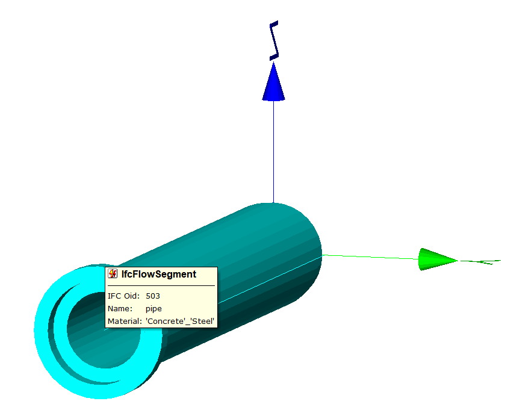

<!-- IfcSharp-documentation, Copyright (c) 2020, Bernhard Simon Bock, Friedrich Eder, MIT License (see https://github.com/IfcSharp/IfcSharpLibrary/tree/master/Licence) --->

# hello_pipe

### Result of hello_pipe.cs shown in the FZK-Viewer

FZKViewer see https://www.iai.kit.edu/1648.php

