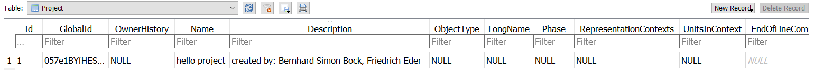
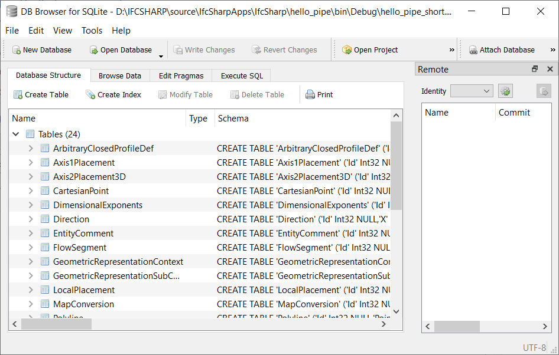

<!-- Getting Started with SQLite - Friedrich Eder 2019 --->
# "Getting Started" with IfcSqLite

## Example

### "Hello Project"

<!-- Wird eine Klasse von `ifc.Model` abgeleitet, so implementiert sie die Methode `ToSqliteFile(string fullpath)`. 
Die `ToSqlite` Methode erzeugt eine Datenbankdatei mit dem übergebenen Dateipfad.  -->

All Classes which extend `ifc.Model` implement the method `ToSqliteFile()`.
This method creates a *SQLite 3* database-file in the application directory.

```csharp
static void Main(string[] args)
{
    HelloProject helloProject = new HelloProject();
    helloProject.ToSqliteFile();
}

class HelloProject : ifc.Model
{
    public HelloProject()
    {
        ifc.Repository.CurrentModel.Header.name = "hello_project";
        var myProject = new ifc.Project(
          GlobalId: new ifc.GloballyUniqueId("057e1BYfHESRdL8IUIxZjL"),
          Name: new ifc.Label("hello project"),
          Description: new ifc.Text("created by: Bernhard Simon Bock, Friedrich Eder"));
    }
}
```

<!-- Es können alle im `ifc` Namespace definierten `ENTITY` Objekttypen instanziiert werden (im oben gezeigten Beispiel `ifc.Project`).  
Die Datenbank enthält das gesamte - aus Reflektion generierte - Datenmodell aller Klassen vom Typ `ifc.ENTITY`.
All die Attribute, die den instanziierten `ifc.ENTITY` übergeben wurden, werden in die entsprechende Relation der SQLite-Datenbank eingefügt.  
Im Beispiel wird ein Datensatz der Relation *IfcProject* mit den Attributen *IfcGlobalId*, *IfcName* und *IfcDescription* befüllt:  -->
The `ifc` namespace provides all available `ENTITY`-Types which can be instantiated at runtime (the code-snippet above, shows `ifc.Project`).  
The database includes the entire data-model (and -relations) of all `ifc.ENTITY`-type objects.
The given attributes of the created `ifc.ENTITY`-objects are stored in their according relation.  
In our example, a data record of *IfcProject* with the attributes *IfcGlobalId*, *IfcName* and *IfcDescription* is stored:  

<!-- TODO: English Screenshots -->

## FAQ

### - What is SQLite?
> SQLite is an in-process library that implements a self-contained, serverless, zero-configuration, transactional SQL database engine. The code for SQLite is in the public domain and is thus free for use for any purpose, commercial or private. SQLite is the most widely deployed database in the world with more applications than we can count, including several high-profile projects.  
> SQLite is an embedded SQL database engine. Unlike most other SQL databases, SQLite does not have a separate server process. SQLite reads and writes directly to ordinary disk files. A complete SQL database with multiple tables, indices, triggers, and views, is contained in a single disk file.

*taken from <https://www.sqlite.org/about.html>*

### - What are the common file-extensions?
The most common file extensions are *.sqlite*, *.db*, *.db3* and *.sqlite3*.  
The former is probably the most sensible, as it makes it obvious what version of SQLite is being used.  
Nevertheless (as with most file types) one can use "custom" extensions which can be even more descriptive (i.e.: *.ifcsqlite*).

### - How can I open a SQLite-file?
There are several tools out there which can work with SQLite files. The most common tool is called "DB Browser for SQLite" (DB4S) <https://sqlitebrowser.org/>  
DB4S is an open source tool which enables the user to create, design and edit SQlite-compatible database-files.  

<!-- TODO: English Screenshots -->

<!-- 
### - Was ist eigentlich SQLite? 
SQLite ist eine prozessinterne Bibliothek, die eine in sich geschlossene, serverlose, transaktionale SQL-Datenbank-Engine implementiert. Der Code für SQLite ist gemeinfrei und somit frei für die Verwendung für jeden Zweck, ob gewerblich oder privat. Im Gegensatz zu den meisten anderen SQL-Datenbanken verfügt SQLite nicht über einen separaten Serverprozess. SQLite liest und schreibt direkt auf normale Festplattendateien. Eine vollständige SQL-Datenbank mit mehreren Tabellen, Indizes, Triggern und Ansichten ist in einer einzigen Festplattendatei enthalten. 
Die Bibliothek ist in der aktuellen Version 3.30.1 (Stand November 2019). 

### - Welche üblichen Dateiendungen hat eine SQLite-Datei?
Die häufigsten Endungen sind *.sqlite*, *.db*, *.db3* und *.sqlite3*.  
Letzteres stellt wohl - für einen allgemeinen Namen - die beste Alternative dar,  
denn die Version der Datenbank-Engine ist "von außen" erkennbar.  
Allerdings kann die Dateiendung auch durch deskriptivere Bezeichner ersetzt werden,  
die direkten Aufschluss über den Inhalt der Datenbankdatei geben (z.B.: *.ifcsqlite*).

### - Wie öffne ich eine SQLite-Datei?
Die einfachste Variante liefert das Tool "DB Browser for SQLite" (DB4S) <https://sqlitebrowser.org/>  
DB4S ist ein Open-Source-Tool zum Erstellen, Entwerfen und Bearbeiten von mit SQLite kompatiblen Datenbankdateien.  
-->

